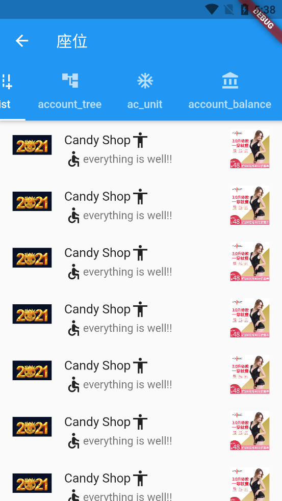

# flutter_app_demo

A new Flutter application.

## Getting Started

This project is a starting point for a Flutter application.

A few resources to get you started if this is your first Flutter project:

- [Lab: Write your first Flutter app](https://flutter.dev/docs/get-started/codelab)
- [Cookbook: Useful Flutter samples](https://flutter.dev/docs/cookbook)

For help getting started with Flutter, view our
[online documentation](https://flutter.dev/docs), which offers tutorials,
samples, guidance on mobile development, and a full API reference.

flutter的组件太多，先一个个体验一下，然后熟悉他的开发方式，先从组件开始，然后就是dart语言的深入理解，然后设计软件框架和架构

SingleChildScrollView:
处理短距离超出屏幕范围，不支持Sliver（薄片）的延迟构建模型，滑动太多会卡顿，长距离滑动使用支持Sliver的ListView、GridView，
至于它的使用方法，可以查看源码属性，支持横竖，支持controller
Stream为dart异步操作的库，有点类似rxjava

dart也是面向对象语言，应该也有类似的设计模式

2021-12-7 尝试简单的观察者设计模式

Container圆角背景图DecorationImage的image设置本地图片ExactAssetImage

